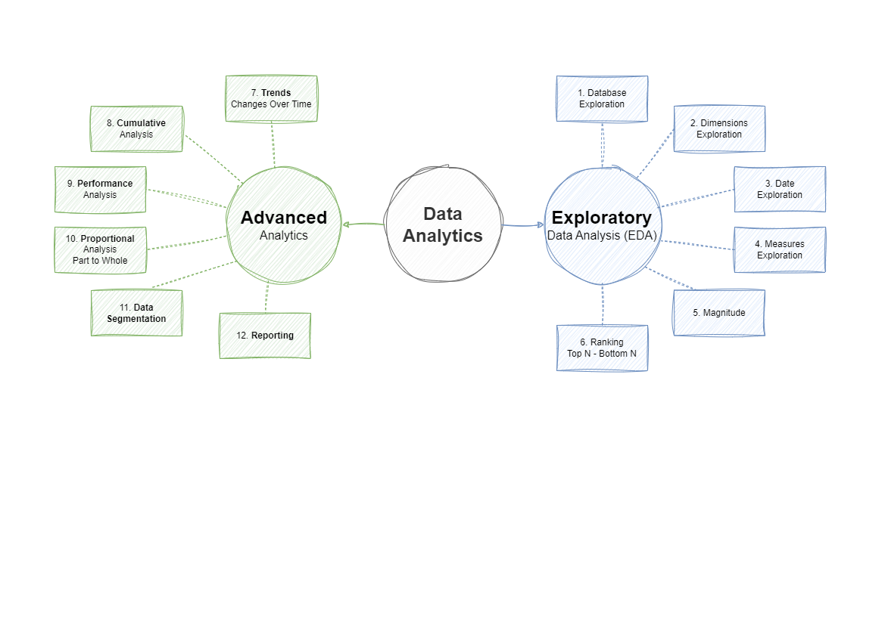

# PostgreSQL_Data_Analytics_Project
This repository contains SQL scripts for analyzing data from a warehouse built in PostgreSQL_Data_Warehouse_Project using CRM and ERP data. It covers key techniques like trend analysis, cumulative metrics, performance tracking, data segmentation, and part-to-whole evaluation.

